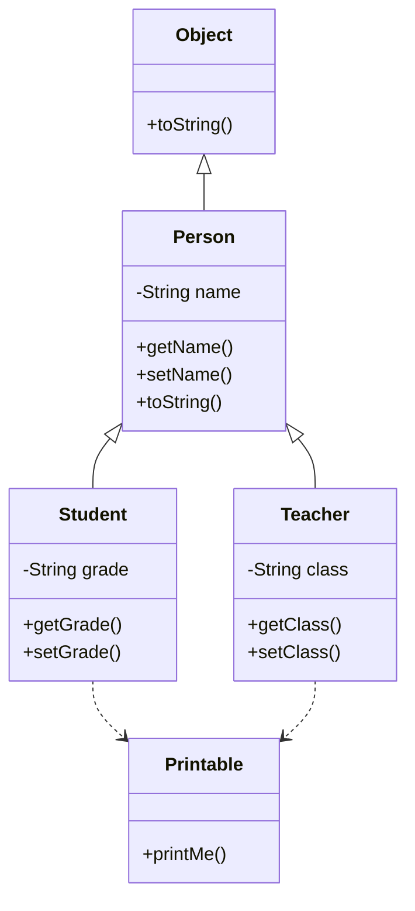
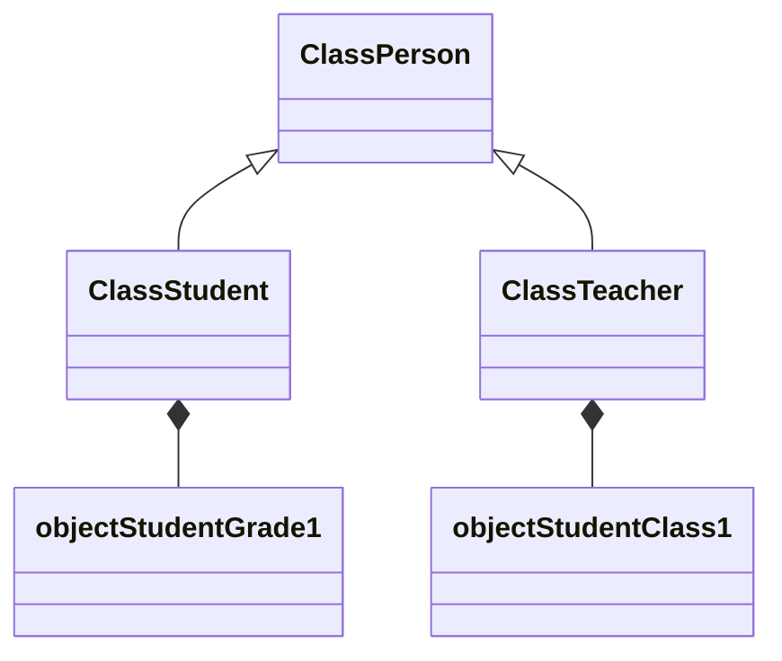

# JavaOO

Demonstrate and review Java OO principles

## Class Diagram

## Object Diagram

## Inheritance

Create a subclass to inherit the properties of a superclass (see Person (superclass) and Student (subclass))

## Abstraction

Force your subclasses to implement specifics and prevent usage at the superclass level

In our example the Person class is Abstract meaning we can't create a Person directly. We use the subclass Student to create a Person with additional details

## Encapsulation

Classes should be as self sufficient as possible.  A Person already knows about Name, so no reason to work on that for student.  Student already knows about grades, no reason to add that elsewhere

## Polymorphism

Because of our implements relationships, we can use common terms to work on these objects.  In our case, both Student and Teacher implement the "Printable" interface and can each define their own printMe() method.  When I call printMe (using the same method call on objects of differnt classes), I can get different results.

## Further Reading
Simple explaination of these concepts:
https://www.freecodecamp.org/news/object-oriented-programming-concepts-21bb035f7260

Java based Carnegie Mellon lecture on these topics:
https://www.cs.cmu.edu/~tcortina/15-121sp10/Unit04A.pdf

Literally "The Book" on this:
https://www.amazon.com/Design-Patterns-Elements-Reusable-Object-Oriented/dp/0201633612

